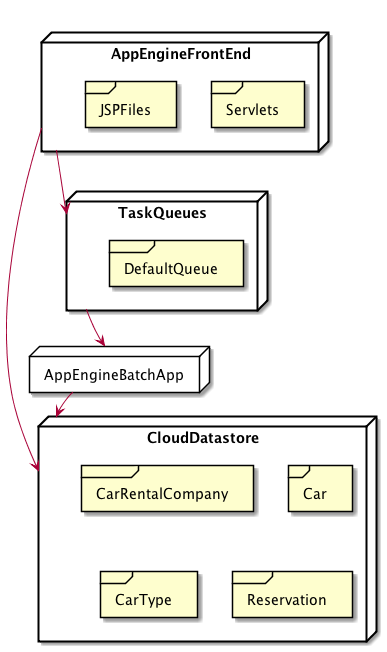
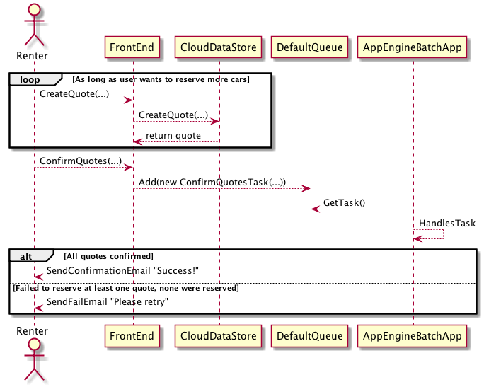

# Design Report

By Pablo Bollansée

## GAE Exercise 3.2

* When to use indirect: When confirming quotes. At this point the actual reservations are made and no double reservations may exist. So the confirming has to happen sequentially as to not interfere with other people that might also be confirming their reservations at the same time. This will take a long time if many user want to do it simultaneously, thus here indirect communication will be required.
* Passed data: Information about their current quotes and reservations are passed around. These aren't the actual object (Quote/Reservation), just information about them. Since the user-side is just a front-end, and doesn't actually do anything other than showing the information to the user, it doesn't make sense to pass references to the data as this would only make the app less safe.

## GAE Exercise 3.3

* Yes. When 'confirmQuotes' (in CarRentalModel) is executed multiple times in parallel it could be that the checks to see if a car is available happens twice before any is confirmed, then both threads will think they can confirm the quote.
* I made the method 'confirmQuotes' synchronized, this way Java will make sure no multiple threads can confirm quotes, so no double reservations will be made.
* This does limit parallelism, since only one ConfirmQuotesTask can do it's work at the same time. If a renter has quotes for only one company, it's possible to synchronize each company on its own (CarRentalCompany), rather than the CarRentalModel. This tasks confirming quotes at different companies can be run simultaneously.

## Design

### Persistence

A Car no-longer knows it's type, since the datastore can't have multiple parents (cars) for the same object (a type). CarType has a list of Cars, this way the model maps nicely onto the datastore, without multiple parents (each cartype has one parent, a company, the cars have their type as parent).

Quote and ReservationConstraints aren't persisted in the datastore.

### Deferred Task

I use a Deferred Task (tasks.ConfirmQuotesTask) to add to the queue, rather than working with workers. So the given worker class remains empty.

### Back-Channel

I send a confirmation email to the user, stating whether the quotes were confirmed or not. This is done from the ConfirmQuotesTask. The run method of this worked always succeeds (no exeption is thrown), so GAE will never retry the task. I do this because the only reason the task can fail is because there are overlapping reservations, and even if the task is retried the reservations will still overlap, so it makes no sense to retry it. The user is however informed about the failure in the confirmation email.

## Diagrams

### Deployment

### Sequence

Showing a renter that wants to reserve one or more cars.

